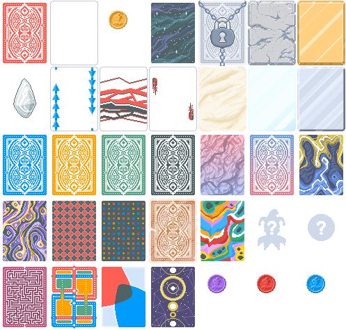
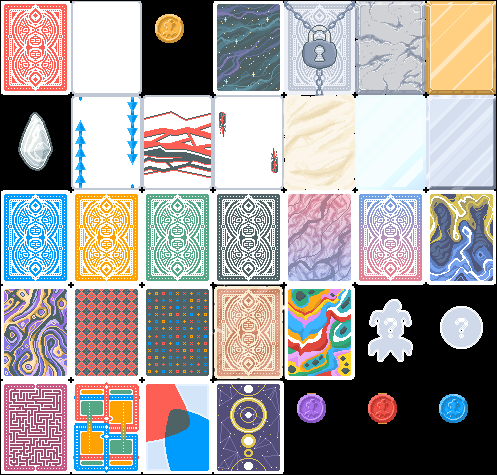

# transparency_recolorizer

Recolorizes transparent pixels in textures so that interpolation between opaque and transparent pixels produces the correct result.

See `Makefile` and `--help` for instructions.

## Examples

### Original texture

### Texture with all the transparent pixels set to opaque (before)

### Texture with all the transparent pixels recolorized and set to opaque (after)

### Texture with all the transparent pixels recolorized and set to transparent (should look the same as the original)

